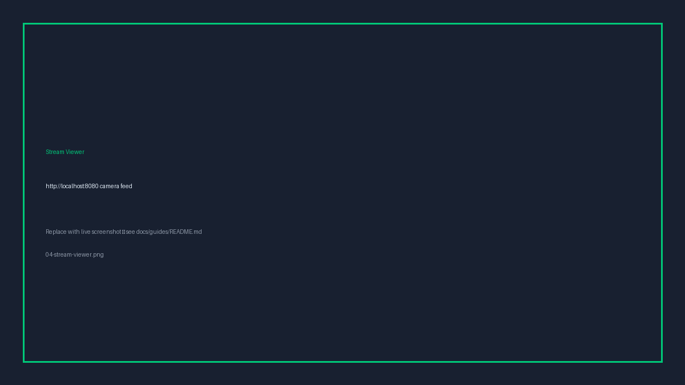
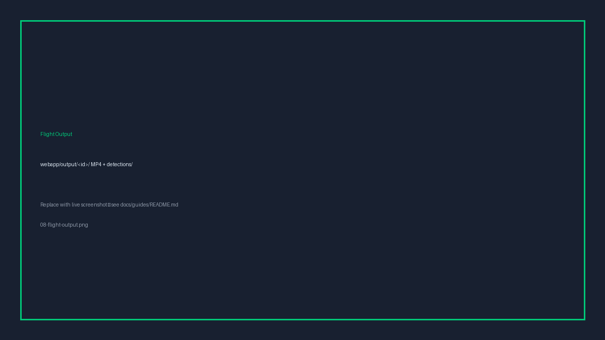

# Scarecrow Drone — Simulation Guide (Command Line)

**Part 1 of 2** — run the GPS-denied indoor simulation and autonomous flight missions **without** the web UI.

| | |
|---|---|
| **Platforms** | Ubuntu/Linux, macOS, Windows (WSL2) |
| **Next guide** | [Webapp user guide](simulation-webapp.md) — Part 2 |

---

## 1. Introduction

Scarecrow Drone is a university project that demonstrates autonomous **GPS-denied indoor flight**. A Holybro X500 quadcopter is simulated in **PX4 SITL** and **Gazebo Harmonic**, using optical flow and a downward rangefinder for position estimation (no GPS). During flight, a **YOLOv8** model detects pigeon targets from the onboard camera and the drone can pursue them as a counter-measure.

This guide walks through:

1. Launching the simulation from the terminal
2. Running flight scripts that verify each capability in turn
3. Running the full hangar circuit pursuit deterrence mission
4. Finding saved detection images, mission maps, and other outputs

**Not covered here:** the web-based HUD console (Part 2) and real-hardware deployment.

---

## 2. Prerequisites

Two terminals cooperate: one keeps the simulator running; the other sends flight commands via MAVSDK.

Complete setup once before your first run. Full instructions are in the [project README](../../README.md).

**Summary:**

```bash
git clone --recurse-submodules https://github.com/riftins98/scarecrow-drone.git
cd scarecrow-drone

# Python 3.11 virtualenv (required — not 3.12+)
python3.11 -m venv .venv-mavsdk
source .venv-mavsdk/bin/activate
pip install -r requirements.txt
pip install -e .
```

**Platform notes**

> **Ubuntu / Linux** — Install PX4 build tools and Gazebo: `cd px4 && bash Tools/setup/ubuntu.sh && cd ..`  
> Also install ffmpeg: `sudo apt install ffmpeg`

> **macOS** — `brew install gz-sim8 opencv qt@5 ffmpeg`  
> First PX4 build may take several minutes.

> **Windows (WSL2)** — Run **all** commands inside your WSL Ubuntu terminal, from the repo path inside WSL (e.g. `/home/you/scarecrow-drone`). The Gazebo GUI is often unstable under WSL; use **Mode B** (headless + browser stream) for demos.

---

## 3. Launch the simulation

Choose one mode. Keep this terminal open for the entire session. Pass the **world name** that matches the flight script you plan to run.

### Mode A — Gazebo GUI (best for live 3D demos)

```bash
source scripts/shell/env.sh
./scripts/shell/launch.sh <world>
```

Example:

```bash
./scripts/shell/launch.sh hangar_lite
```

**What you should see:** a Gazebo window opens with the selected environment and the drone at spawn. The terminal shows build/startup progress.


**First run:** PX4 compiles on first launch — expect several minutes. Later runs are faster. Skip rebuild with `--no-build` if already built.

### Mode B — Headless + browser stream (best for WSL / projector)

```bash
source scripts/shell/env.sh
./scripts/shell/launch_with_stream.sh <world> --headless --fixed
```

Example:

```bash
./scripts/shell/launch_with_stream.sh hangar_lite --headless --fixed
```

**What you should see:** no Gazebo window. A browser tab opens at `http://localhost:8080/` showing fixed camera feeds.



**Camera flag:** `--fixed` selects the overhead monitor camera only. Flight scripts use the **drone** onboard camera — never the fixed monitor feed.

---

## 4. Run a flight mission

Open a **second terminal**. Leave the simulator running in the first.

```bash
cd scarecrow-drone          # your repo path
source .venv-mavsdk/bin/activate
python3 scripts/flight/<script>.py [options]
```

Each flight script verifies a different capability. Run them in order while learning the system, or jump straight to the capstone mission.

### Flight plan modes

| Script | What it verifies | Suggested world |
|--------|------------------|-----------------|
| `sensor_check.py` | Lidar, camera, and optical flow — no takeoff | Any running sim |
| `demo_flight_v2.py` | Takeoff, hover, YOLO detection, landing, flight video | `drone_garage_pigeon_3d` |
| `wall_follow_v2.py` | Single-leg GPS-denied wall follow | `drone_garage`, `hangar_lite` |
| `room_circuit_v2.py` | Four-leg wall-follow circuit | `drone_garage` |
| `demo_flight_pursuit.py` | Hover detection → pursue target → hold at range | `drone_garage_pigeon_3d` |
| `hangar_circuit_pursuit.py` | Full deterrence mission: 4-leg hangar circuit, live YOLO, pursuit, target removal, mission map | `hangar_lite` |

---

## 5. Where results are saved

`hangar_circuit_pursuit.py` writes to:

```
webapp/output/<flight_id>/
  detections/          # PNG frames saved during pursuit (throttled)
  map.json             # lidar mission map
  map_annotated.png    # customer-facing annotated map
```

The flight ID is printed at startup (`hangar_circuit_pursuit_<timestamp>` when run standalone).

`demo_flight_v2.py` also saves a full-flight MP4:

```
webapp/output/<flight_id>/
  detections/
  flight_camera.mp4    # takeoff → hover → land recording
```



Open detection images directly from `detections/`. Open `map_annotated.png` to review the mission path and pursuit events.
