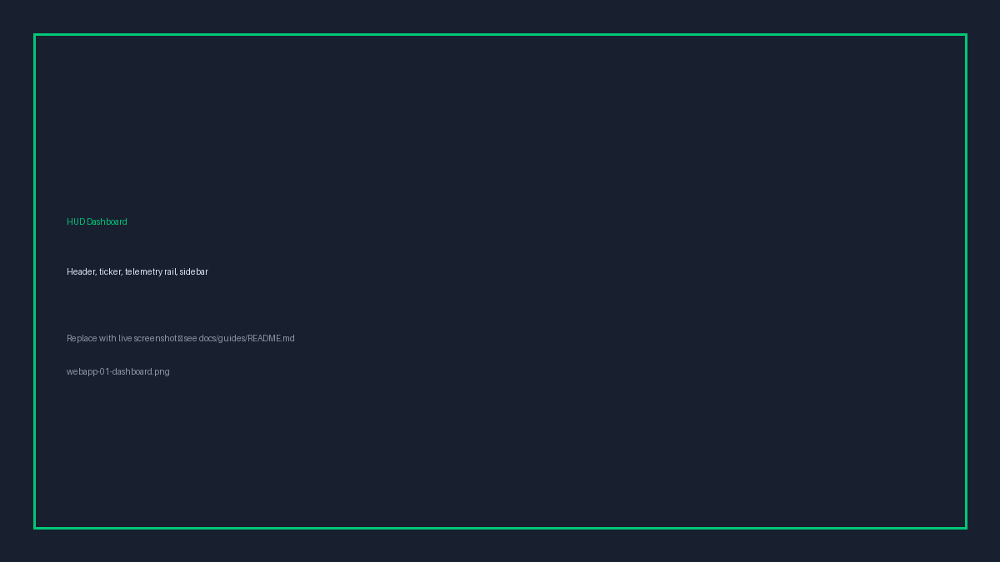
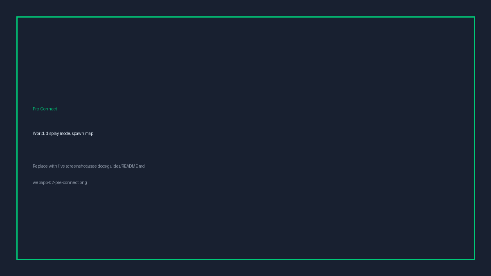
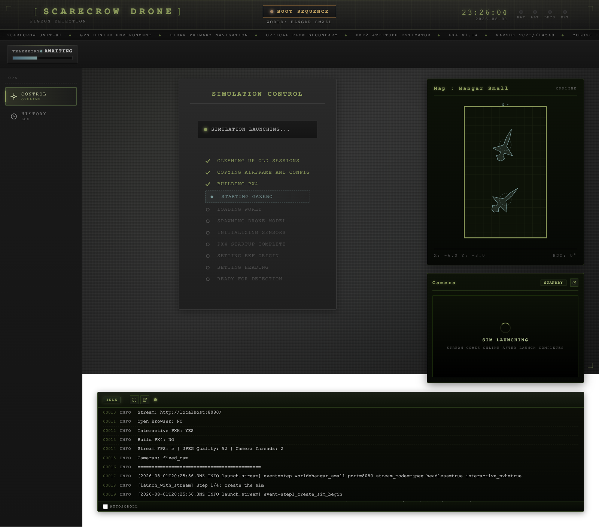
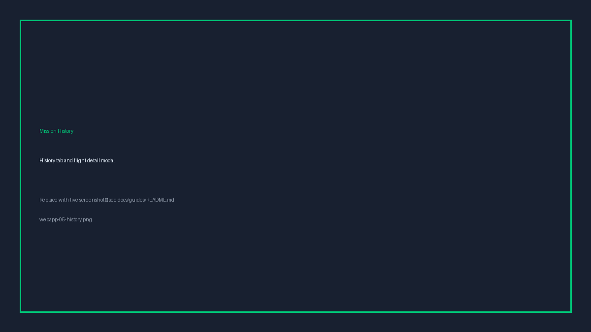

# Scarecrow Drone — Webapp User Guide

**Part 2 of 2** — operate the GPS-denied simulation and autonomous flight missions through the **HUD web console**.

| | |
|---|---|
| **Platforms** | Ubuntu/Linux, macOS, Windows (WSL2 + native browser) |
| **Previous guide** | [Simulation (CLI)](simulation-cli.md) — Part 1 |

---

## 1. Introduction

Scarecrow Drone includes a browser-based **mission control console** for live demos and academic presentations. The UI launches PX4 + Gazebo, starts flight scripts, streams headless camera feeds, and shows real-time telemetry parsed from the running mission.

This guide walks through:

1. Starting the webapp
2. Connecting the simulation from the Control panel
3. Running a flight mission (including the full hangar circuit pursuit)
4. Reviewing mission history, detection images, and recordings

**Not covered here:** command-line simulation (Part 1) and real-hardware deployment.

---

## 2. Prerequisites

Complete project setup once before your first demo. Full instructions are in the [project README](../../README.md).

**Summary:** set up the environment for your platform exactly as in Part 1. macOS uses pixi; Windows and Linux use Docker.

**Platform notes**

> **macOS** — `pixi run webapp` (dev, `http://localhost:3000`) or `pixi run webapp-prod`
> (built UI on `http://localhost:8000`, the same shape the Docker image ships).

> **Windows and Linux** — `docker compose up`, then open `http://localhost:8000`.
> That single URL is the whole interface: the backend serves the UI and the API
> on one port. Run it inside WSL2 on Windows, and run `bash docker/build.sh`
> once first, which also detects the GPU.

> **Legacy (WSL virtualenv)** — `cd webapp && ./start.sh`, then open
> `http://localhost:3000`. `webapp/Start Scarecrow.bat` does the same from
> Windows Explorer.

The first connect after a fresh build is slow because PX4 relinks. Later
connects are quick.

---

## 3. Console layout

The dashboard uses a military-style HUD layout:

| Area | Purpose |
|------|---------|
| **Header** | Callsign, system state (STANDBY → BOOT SEQUENCE → SYS NOMINAL → MISSION ACTIVE), clock, indicator lights |
| **Ticker** | Scrolling status tags for the current session |
| **Telemetry rail** | Live gauges during flight (phase, altitude, lidar distances, detections, etc.) |
| **Sidebar — OPS** | **Control** (sim + missions) and **History** (past flights) |
| **Main panel** | Simulation controls, spawn map or live minimap, camera stream (headless), system log |



---

## 4. Connect the simulation

Open the **Control** tab. Before connecting, configure the session on the left; use the **spawn map** on the right to pick a start position. The map is derived from the world's own geometry, so it works for any mapped world.

### Pre-connect options

| Field | Description |
|-------|-------------|
| **World** | Gazebo environment to load (`hangar_lite` for the capstone pursuit mission) |
| **Display** | **GUI** opens a Gazebo window; **Headless** streams the cameras to the browser on port 8080. In the container GUI is hidden, because there is no display it could open a window on. |
| **Stream camera** | Headless only — overhead fixed camera (or other world cameras) |
| **Spawn map** | Click a valid floor tile; red-hatched margins and parked aircraft are blocked |

Click **Connect**. A live checklist shows launch progress (cleanup → build → Gazebo → sensors → ready).





**What you should see:** status changes to **Simulation Online**; the spawn map becomes a **live minimap** tracking the drone; in headless mode a camera stream panel appears.

---

## 5. Run a flight mission

Once connected, choose a **flight script** and any parameters shown in the dynamic form. Click **Start Detection**.

### Recommended scripts for a demo

| Script | What the audience sees |
|--------|------------------------|
| `hangar_circuit_pursuit.py` | **The full mission.** Four-leg hangar circuit, live detection, pursuit, return to the break-off point, resume the leg, annotated mission map. |
| `room_circuit_map.py` | A mapping circuit. Shorter, and it produces a map without the pursuit behaviour. |
| `sensor_check.py` | Sensor diagnostics with no takeoff. Useful to show the sensors are live before flying. |

These are the only three the dropdown offers, because the form is built by
introspecting `scripts/flight/`. For the full deterrence demo pick
**`hangar_lite`** as the world and **`hangar_circuit_pursuit.py`** as the
script. `--ceiling-clearance` of `1.0` is worth setting if the form exposes
it.

During flight:

- The header state becomes **MISSION ACTIVE**
- The **telemetry rail** fills with live readouts (phase, AGL, lidar, detections, leg progress, etc.)
- The **minimap** shows the drone path in real time
- **Detection Time**, frame count, and pigeon hits appear in the control panel


Click **Stop Detection** to detach from the flight script; the drone finishes landing on its own. **Disconnect** ends the simulation (disabled while flying).

### Emergency controls

| Control | When to use |
|---------|-------------|
| **RESET DRONE** | Kill the flight, disarm, teleport back to spawn — safe recovery during a demo |
| **Re-spawn panel** | Move the drone to a new floor position without relaunching the sim (visible when not flying) |

---

## 6. Review mission results

Switch to the **History** tab in the sidebar. Each past flight appears as a mission card with duration, frames processed, and detection count.

Click a card to open the detail modal:

| Tab | Content |
|-----|---------|
| **Summary** | Flight metadata and status |
| **Detections** | Gallery of saved YOLO frames |
| **Recording** | Flight video. No mission enables recording today, so this is normally empty. |

`hangar_circuit_pursuit.py` saves pursuit images and `map.json` under `webapp/output/<flight_id>/`. View detections in the modal; open the **Mission Map** tab to see the annotated circuit rendered on demand by the backend.



---

## 7. Suggested demo flow (academic presentation)

1. **Introduce the problem** — GPS-denied indoor flight; optical flow + rangefinder instead of GPS.
2. **Connect** — `hangar_lite`, headless + fixed camera so the audience sees the overhead stream.
3. **Show the minimap** — explain spawn placement and live drone tracking.
4. **Start** `hangar_circuit_pursuit.py` — narrate telemetry as the drone circuits, detects, and pursues.
5. **Open History** — show detection gallery and discuss saved evidence.
6. **RESET** if needed — recover quickly without restarting the whole stack.

---

## Building a Word document for reviewers

```bash
pandoc docs/guides/simulation-webapp.md \
  -o docs/guides/simulation-webapp.docx \
  --resource-path=docs/guides
```

See [docs/guides/README.md](README.md) for screenshot capture notes and pandoc install.
